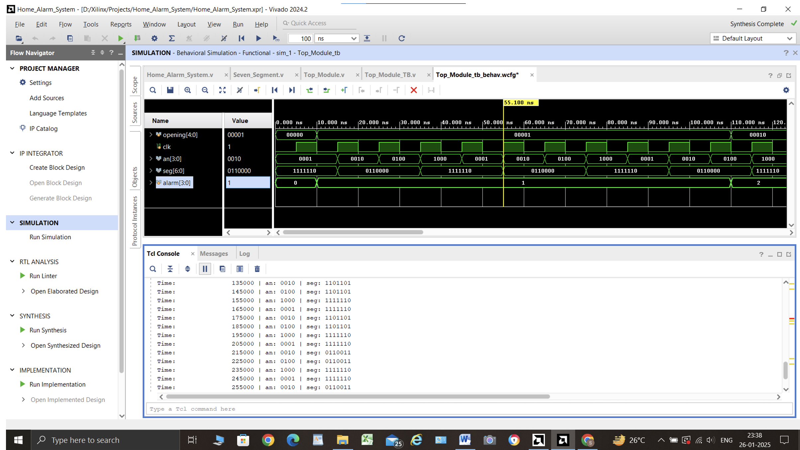

# **Home Alarm System with 7-Segment Display** 🚨💡
A **Verilog-based home alarm system** that monitors door/window openings and displays the status on a **7-segment display**. Designed for **FPGA implementation using Xilinx Vivado**.

---

## **📌 Project Overview**
This project implements a **hardware alarm system** with real-time monitoring of **home security status**.  
Key components:
- **Home Alarm System**: Detects open doors/windows and triggers an alarm if necessary.
- **7-Segment Display Controller**: Displays alarm and opening status on a multiplexed **7-segment display**.
- **Top Module**: Integrates both subsystems for full functionality.

🛠️ **Designed for FPGA deployment** and tested using **Xilinx Vivado**.

---

## **✨ Features**
✔️ **Monitors up to 5 doors/windows**  
✔️ **Triggers an alarm when 3 or more are open**  
✔️ **Multiplexed 7-segment display for real-time status updates**  
✔️ **Clock-controlled digit switching for clear visualization**  
✔️ **Fully verified with testbench simulations**  

---

## **🛠️ Testbench & Verification**
Tested using a **self-checking testbench (`Top_Module_tb.v`)**, ensuring:
- **Correct 7-segment display output** for different door/alarm states.
- **Alarm activation when 3 or more openings are detected**.
- **Clock-driven multiplexing for display stability**.

✅ Verified through **behavioral simulations** in **Xilinx Vivado**.

---

## **▶️ Simulation & Usage**
### **🔹 Steps to Run in Xilinx Vivado**
1️⃣ Open **Vivado** and create a new project.  
2️⃣ Add **Verilog source files** (`source_code/`) and the **testbench** (`testbench/`).  
3️⃣ Run **Behavioral Simulation** to verify **waveforms & outputs**.  
4️⃣ (Optional) Perform **Synthesis & Implementation** for FPGA deployment.

---

## **🛠️ Technology Stack**
🔹 **Hardware Description Language:** Verilog  
🔹 **Simulation & Synthesis:** Xilinx Vivado  
🔹 **Target Platform:** FPGA  
🔹 **Testing:** Self-checking testbenches  

---

## **📸 Screenshots & Waveforms**
Simulation results and waveforms are available in the [`simulation_results/`](simulation_results/) folder.

Example:  

---

## **🚀 Challenges & Learnings**
- **Multiplexed 7-segment control** required careful **timing adjustments** for stable display.  
- **Alarm activation logic** was optimized to handle edge cases like **rapid opening/closing events**.  
- **FPGA resource utilization analysis** provided insights on efficient **hardware design practices**.  

---

## **📈 Future Enhancements**
✅ **Expand to monitor more doors/windows**.  
✅ **Implement SPI/UART communication for external monitoring**.  
✅ **Integrate FPGA-based buzzer for real-time alerts**.  
✅ **Optimize power consumption for real-world deployment**.  

---

## **📩 Contact**
📧 **Shreya Arokianathan**  
🔗 [LinkedIn](https://linkedin.com/shreya-arokianathan)  
📧 arokianathanshreya@gmail.com  

---

🛠️ **Ready for FPGA implementation & real-world applications!** 🚀  
🔗 **Explore the code and contribute!**  
