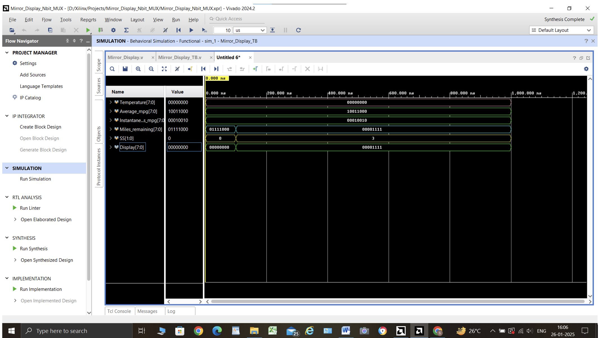

# Mirror Display for Vehicle Dashboard

## Overview
This project implements a mirror display system for a vehicle's dashboard. It takes in sensor data (e.g., temperature, average miles per gallon (MPG), instantaneous MPG, and miles remaining) and displays the corresponding value on a display based on the selector switches. The purpose of this project is to efficiently manage and display critical vehicle data on a single screen by switching between different data inputs using selector switches.

## Features
- Displays vehicle data including temperature, average MPG, instantaneous MPG, and miles remaining.
- Uses a 2-bit selector switch (`SS`) to toggle between four data types.
- Data values are represented using 8-bit registers.
- Designed with simplicity and modularity in mind, making it easy to adapt for various vehicle dashboard systems.

## Testbench & Verification
The testbench for the Mirror Display module is defined in `Mirror_Display_TB.v`. It stimulates the four input sensors (`Temperature`, `Average_mpg`, `Instantaneous_mpg`, `Miles_remaining`) and cycles through different values for the selector switches (`SS`). The testbench verifies the functionality of the display logic by checking that the correct sensor data is displayed based on the switch settings.

### Test Cases
1. **Initial State:** Verify that the correct value is displayed when the selector switch is at `SS = 00`.
2. **Switch Changes:** Ensure the display changes correctly when the switch is toggled between `SS = 00` to `SS = 11`.
3. **Boundary Testing:** Test with both low and high values for sensor inputs to ensure proper handling of 8-bit values.

## Simulation & Usage
### Setting up in Xilinx Vivado:
1. Clone the repository to your local machine.
2. Create a new project in Vivado and add the `Mirror_Display.v` and `Mirror_Display_TB.v` files.
3. Implement the simulation by running a behavioral simulation.
4. Examine the results in the Vivado waveform viewer to validate the functionality.

## Technology Stack
- **Hardware Description Language:** Verilog
- **Simulation Tool:** Xilinx Vivado
- **Version Control:** Git, GitHub

## Screenshots/Diagrams
- **Simulation Results:** 
Below are the simulation waveforms for the Mirror Display module. These waveforms illustrate how the display changes when the selector switch is toggled.

## Challenges & Learnings
- **Challenge:** Handling multiple input signals efficiently without data collision. This was overcome by ensuring each signal is given its own time slot for evaluation in the `always @(*)` block.
- **Learning:** Improved understanding of switch-controlled data multiplexing and the use of Verilog for system design in embedded applications.

## Future Enhancements
- **Graphical Display Support:** Expand the project to support graphical displays such as LCDs or OLEDs.
- **Dynamic Data Update:** Implement real-time data update capabilities where the display refreshes continuously as sensor values change.
- **Integration with Hardware:** Integrate the Verilog module with real hardware (e.g., an FPGA board or microcontroller) for live testing in a vehicle environment.
